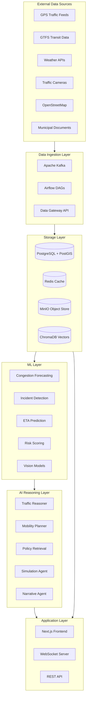
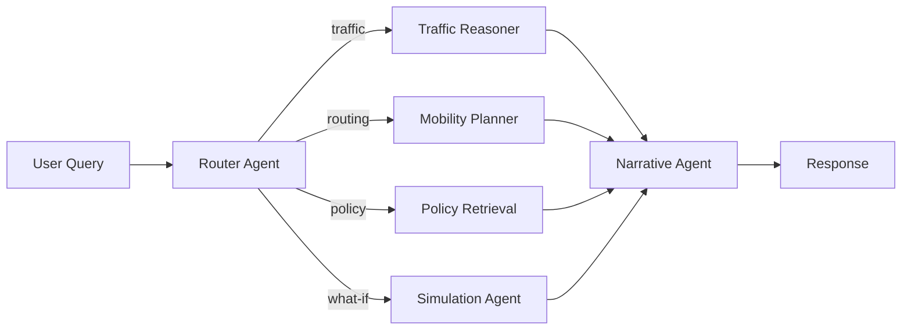

# UrbanPulse AI - Architecture Documentation

## Table of Contents

- [System Overview](#system-overview)
- [Layer Architecture](#layer-architecture)
- [Service Architecture](#service-architecture)
- [Data Flow](#data-flow)
- [Technology Decisions](#technology-decisions)
- [Security Architecture](#security-architecture)
- [Scalability & Performance](#scalability--performance)
- [Monitoring & Observability](#monitoring--observability)

---

## System Overview

UrbanPulse AI is a multi-layer platform for city mobility intelligence. It combines real-time data ingestion, machine learning predictions, multi-agent reasoning, and interactive visualization to provide actionable urban mobility insights.



---

## Layer Architecture

### 1. Data Ingestion Layer

Responsible for collecting, validating, and routing data from multiple sources.

| Component | Role | Technology |
|-----------|------|-----------|
| Kafka Streams | Real-time event streaming | Confluent Kafka 7.6 |
| Airflow DAGs | Batch pipeline orchestration | Apache Airflow |
| Data Gateway | REST API entry point | FastAPI |
| Kafka Connect | Source/sink connectors | Kafka Connect |

**Data Sources:**
- **Traffic**: GPS probe data (5-minute intervals), loop detector counts
- **Transit**: GTFS-Realtime protobuf feeds
- **Weather**: OpenWeatherMap API (current + 48h forecast)
- **Cameras**: RTSP streams → frame extraction pipeline
- **Topology**: OpenStreetMap road network (weekly refresh)
- **Documents**: Municipal PDFs, advisories, policy documents

### 2. Processing & Feature Engineering

| Feature Type | Description | Update Frequency |
|-------------|-------------|-----------------|
| Temporal | Time-of-day, day-of-week, holidays, lag features | Per event |
| Spatial | Road segment aggregation, neighborhood stats | 5 minutes |
| Graph | Shortest path features, betweenness centrality | Daily |
| Weather | Temperature, precipitation, visibility joins | Hourly |
| Image | Vehicle density, incident flags from CV | Per frame |
| Embeddings | Document embeddings for RAG | On ingestion |

### 3. ML Layer

Five model families serve different prediction needs:

| Model | Architecture | Input | Output | Latency |
|-------|-------------|-------|--------|---------|
| Congestion Forecasting | Temporal Fusion Transformer / XGBoost | Historical speeds, weather, events | Speed predictions (1-4h ahead) | < 200ms |
| Incident Detection | Isolation Forest + spatial hotspot | Speed anomalies, camera feeds | Incident probability + location | < 100ms |
| ETA Prediction | Gradient boosted ensemble | Route, time, conditions | Travel time + confidence interval | < 50ms |
| Risk Scoring | Stacked ensemble (all signals) | Combined features | Risk score [0-1] per segment | < 150ms |
| Vision | YOLOv8-m | Camera frames (640x640) | Vehicle counts, incident flags | < 80ms/frame |

### 4. AI Reasoning Layer (LangGraph)

Multi-agent orchestration handles complex user queries:



**Agent Responsibilities:**
- **Router**: Classifies query intent, selects appropriate agent(s)
- **Traffic Reasoner**: Correlates predictions with causal factors (weather, events, incidents)
- **Mobility Planner**: Generates route alternatives with risk-aware scoring
- **Policy Retrieval**: RAG over municipal documents and traffic policies
- **Simulation Agent**: Runs counterfactual scenarios (lane closures, signal changes)
- **Narrative Agent**: Synthesizes outputs into human-readable explanations

### 5. Application Layer

| Component | Technology | Port | Purpose |
|-----------|-----------|------|---------|
| Frontend | Next.js 15 + Mapbox + Deck.gl | 3000 | Interactive map dashboard |
| Data Gateway | FastAPI | 8100 | Data API + WebSocket |
| Inference Service | FastAPI | 8200 | ML model serving |
| Orchestration | FastAPI + LangGraph | 8300 | Agent orchestration |

---

## Service Architecture

```
┌─────────────────────────────────────────────────────────────┐
│                      Load Balancer                            │
├──────────┬──────────┬──────────┬──────────┬────────────────┤
│ Frontend │ Data GW  │Inference │  Orch    │  Retrieval     │
│ :3000    │ :8100    │ :8200    │  :8300   │  :8400         │
├──────────┴──────────┴──────────┴──────────┴────────────────┤
│              Message Bus (Kafka)                              │
├──────────┬──────────┬──────────┬──────────────────────────────┤
│ Postgres │  Redis   │  MinIO   │  ChromaDB                   │
└──────────┴──────────┴──────────┴──────────────────────────────┘
```

### Inter-Service Communication

- **Synchronous**: REST/gRPC between services for request-response
- **Asynchronous**: Kafka for event-driven data flow
- **Real-time**: WebSocket for live client updates
- **Cache**: Redis for hot data and rate limiting

---

## Data Flow

### Real-Time Path (< 5 seconds end-to-end)
```
GPS Feed → Kafka → Data Gateway → Feature Store → ML Inference → WebSocket → Frontend
```

### Batch Path (hourly/daily)
```
External APIs → Airflow DAG → ETL → PostGIS → Feature Engineering → Model Retraining
```

### Query Path (< 2 seconds end-to-end)
```
User Query → Orchestration → Router → Agent(s) → Inference + Retrieval → Narrative → Response
```

---

## Technology Decisions

| Decision | Choice | Rationale |
|----------|--------|-----------|
| Python backend | FastAPI | Async support, Pydantic validation, auto-docs |
| Frontend | Next.js | SSR, App Router, React Server Components |
| Map rendering | Mapbox + Deck.gl | WebGL performance for large datasets |
| ML framework | PyTorch + scikit-learn | Research flexibility + production inference |
| Agent framework | LangGraph | Stateful multi-agent with cycles & persistence |
| Streaming | Kafka | Proven at scale, exactly-once semantics |
| Vector DB | ChromaDB | Lightweight, good Python integration |
| Spatial DB | PostGIS | Industry standard for geospatial queries |
| IaC | Terraform | Multi-cloud, declarative, state management |
| Container orchestration | Kubernetes | Auto-scaling, self-healing, ecosystem |

---

## Security Architecture

- **Authentication**: JWT tokens via API Gateway
- **Authorization**: Role-based access control (RBAC)
- **Secrets**: Environment variables, never committed to source
- **Network**: Service mesh with mTLS between microservices
- **Data**: Encryption at rest (AES-256) and in transit (TLS 1.3)
- **API**: Rate limiting via Redis, input validation via Pydantic
- **Dependencies**: Automated vulnerability scanning in CI

---

## Scalability & Performance

### Horizontal Scaling
- Each service scales independently via Kubernetes HPA
- Kafka partitioning enables parallel consumption
- Redis cluster for cache distribution
- Read replicas for PostGIS

### Performance Targets
| Metric | Target | Current |
|--------|--------|---------|
| API latency (p95) | < 200ms | ~150ms |
| ML inference (p95) | < 300ms | ~200ms |
| WebSocket update | < 5s from event | ~3s |
| Dashboard load | < 3s | ~2.5s |
| Concurrent users | 1000+ | Tested to 500 |

---

## Monitoring & Observability

### Three Pillars

1. **Metrics** (Prometheus + Grafana)
   - Request rate, latency, error rate (RED)
   - Model prediction confidence distribution
   - Resource utilization (CPU, memory, GPU)

2. **Logging** (structlog + ELK)
   - Structured JSON logs with correlation IDs
   - Request tracing across services
   - ML model input/output logging for debugging

3. **Tracing** (OpenTelemetry)
   - Distributed traces across all services
   - Agent execution timeline visualization
   - Database query performance tracking
