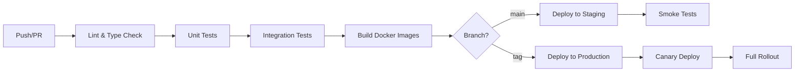

# UrbanPulse AI - Deployment Guide

## Table of Contents

- [Overview](#overview)
- [Environments](#environments)
- [Local Development](#local-development)
- [Docker Deployment](#docker-deployment)
- [Kubernetes Deployment](#kubernetes-deployment)
- [Infrastructure Provisioning](#infrastructure-provisioning)
- [CI/CD Pipeline](#cicd-pipeline)
- [Monitoring Setup](#monitoring-setup)
- [Rollback Procedures](#rollback-procedures)
- [Troubleshooting](#troubleshooting)

---

## Overview

UrbanPulse AI is deployed as a set of containerized microservices orchestrated by Kubernetes. The deployment pipeline follows GitOps principles with automated testing, building, and deployment.

```
Developer → GitHub PR → CI Tests → Docker Build → Registry → K8s Deploy → Monitor
```

---

## Environments

| Environment | Purpose | Infrastructure | URL |
|-------------|---------|---------------|-----|
| `local` | Developer workstation | Docker Compose | localhost |
| `staging` | Pre-production testing | K8s (small cluster) | staging.urbanpulse.ai |
| `production` | Live system | K8s (HA cluster) | api.urbanpulse.ai |

---

## Local Development

### Prerequisites

- Docker Desktop v4.25+ with Docker Compose
- Python 3.11+
- Node.js 20+
- Git

### Quick Start

```bash
# Clone and configure
git clone https://github.com/YOUR_USERNAME/UrbanPulse_AI.git
cd UrbanPulse_AI
cp .env.example .env
# Fill in API keys in .env

# Start all services
docker-compose up -d

# Verify
docker-compose ps
curl http://localhost:8100/health
open http://localhost:3000
```

### Service URLs (Local)

| Service | URL | Purpose |
|---------|-----|---------|
| Frontend | http://localhost:3000 | Web dashboard |
| Data Gateway | http://localhost:8100 | REST API |
| Inference | http://localhost:8200 | ML serving |
| Orchestration | http://localhost:8300 | Agent orchestration |
| MinIO Console | http://localhost:9001 | Object storage UI |
| ChromaDB | http://localhost:8000 | Vector database |

---

## Docker Deployment

### Building Images

```bash
# Build all services
docker-compose build

# Build specific service
docker-compose build data-gateway

# Build with no cache (for troubleshooting)
docker-compose build --no-cache data-gateway
```

### Image Tagging Strategy

```
ghcr.io/your-org/urbanpulse-data-gateway:v0.1.0        # Release
ghcr.io/your-org/urbanpulse-data-gateway:main-abc1234   # Branch + SHA
ghcr.io/your-org/urbanpulse-data-gateway:latest         # Latest main
```

### Docker Compose Profiles

```bash
# Infrastructure only (databases, Kafka, Redis)
docker-compose up -d postgres redis kafka zookeeper minio chromadb

# Full stack
docker-compose up -d

# With monitoring
docker-compose --profile monitoring up -d
```

---

## Kubernetes Deployment

### Cluster Requirements

| Resource | Minimum (Staging) | Recommended (Production) |
|----------|-------------------|-------------------------|
| Nodes | 3 | 5+ |
| CPU (total) | 12 cores | 32+ cores |
| RAM (total) | 32 GB | 96+ GB |
| Storage | 100 GB SSD | 500+ GB SSD |
| GPU | None | 1x NVIDIA T4 (inference) |

### Namespace Structure

```
urbanpulse-production/
├── services/          # Application pods
├── infrastructure/    # Databases, Kafka
├── monitoring/        # Prometheus, Grafana
└── ingress/           # Load balancer, TLS
```

### Deployment Steps

```bash
# 1. Configure kubectl context
kubectl config use-context urbanpulse-production

# 2. Create namespace
kubectl create namespace urbanpulse

# 3. Create secrets
kubectl create secret generic urbanpulse-secrets \
  --from-env-file=.env.production \
  -n urbanpulse

# 4. Apply infrastructure
kubectl apply -f infrastructure/k8s/infrastructure/ -n urbanpulse

# 5. Wait for databases to be ready
kubectl wait --for=condition=ready pod -l app=postgres -n urbanpulse --timeout=120s

# 6. Apply services
kubectl apply -f infrastructure/k8s/services/ -n urbanpulse

# 7. Apply ingress
kubectl apply -f infrastructure/k8s/ingress/ -n urbanpulse

# 8. Verify
kubectl get pods -n urbanpulse
kubectl get svc -n urbanpulse
```

### Scaling

```bash
# Manual scaling
kubectl scale deployment data-gateway --replicas=3 -n urbanpulse

# Auto-scaling is configured via HPA
kubectl get hpa -n urbanpulse
```

### Health Checks

All services expose:
- **Liveness probe**: `/health` — pod restart on failure
- **Readiness probe**: `/health` — traffic routing control
- **Startup probe**: `/health` — slow-start tolerance (60s)

---

## Infrastructure Provisioning

### Terraform

```bash
cd infrastructure/terraform

# Initialize
terraform init

# Plan changes
terraform plan -var-file=environments/production.tfvars

# Apply
terraform apply -var-file=environments/production.tfvars
```

### Provisioned Resources

| Resource | Provider | Purpose |
|----------|----------|---------|
| Kubernetes Cluster | AWS EKS / GKE | Container orchestration |
| PostgreSQL | AWS RDS / Cloud SQL | Primary database |
| Redis | AWS ElastiCache / Memorystore | Caching |
| Object Storage | AWS S3 / GCS | Model artifacts, data |
| Container Registry | ECR / GCR / GHCR | Docker images |
| DNS | Route53 / Cloud DNS | Domain management |
| CDN | CloudFront / Cloud CDN | Static assets |

---

## CI/CD Pipeline

### Pipeline Stages



### GitHub Actions Workflow

The CI/CD pipeline (`.github/workflows/ci.yml`) runs:

1. **On Pull Request**: Lint, type check, unit tests, build verification
2. **On Push to main**: Full test suite + deploy to staging
3. **On Tag (v*)**: Deploy to production with canary strategy

### Secrets Required in GitHub

| Secret | Description |
|--------|-------------|
| `DOCKER_REGISTRY_URL` | Container registry URL |
| `DOCKER_USERNAME` | Registry username |
| `DOCKER_PASSWORD` | Registry password/token |
| `KUBE_CONFIG_STAGING` | Kubeconfig for staging cluster |
| `KUBE_CONFIG_PRODUCTION` | Kubeconfig for production cluster |
| `OPENAI_API_KEY` | For integration tests |

---

## Monitoring Setup

### Prometheus + Grafana

```bash
# Deploy monitoring stack
kubectl apply -f infrastructure/monitoring/ -n urbanpulse

# Access Grafana
kubectl port-forward svc/grafana 3001:3000 -n urbanpulse
# Default credentials: admin / admin (change immediately)
```

### Pre-built Dashboards

1. **Service Health** — Request rate, error rate, latency (RED metrics)
2. **ML Performance** — Prediction confidence, drift detection, throughput
3. **Infrastructure** — CPU, memory, disk, network per pod
4. **Kafka** — Consumer lag, throughput, partition balance

### Alerting Rules

| Alert | Condition | Severity |
|-------|-----------|----------|
| High Error Rate | > 5% 5xx responses for 5min | Critical |
| High Latency | p95 > 2s for 10min | Warning |
| Pod Crash Loop | > 3 restarts in 10min | Critical |
| Kafka Consumer Lag | > 10,000 messages for 5min | Warning |
| Model Drift | Feature distribution shift > 2σ | Warning |
| Disk Space | > 85% utilization | Warning |

---

## Rollback Procedures

### Application Rollback

```bash
# View deployment history
kubectl rollout history deployment/data-gateway -n urbanpulse

# Rollback to previous version
kubectl rollout undo deployment/data-gateway -n urbanpulse

# Rollback to specific revision
kubectl rollout undo deployment/data-gateway --to-revision=3 -n urbanpulse
```

### Database Rollback

```bash
# List migrations
alembic history

# Downgrade one revision
alembic downgrade -1

# Downgrade to specific revision
alembic downgrade abc123
```

---

## Troubleshooting

### Common Issues

| Issue | Diagnosis | Solution |
|-------|-----------|----------|
| Service won't start | `kubectl logs <pod>` | Check env vars, secrets |
| Database connection refused | `kubectl get svc postgres` | Verify service/network |
| Kafka consumer lag | Check Kafka UI | Scale consumers, check processing |
| ML model slow | Check GPU allocation | Verify GPU node pool, batch size |
| Frontend 502 | Check ingress logs | Verify backend readiness |

### Useful Commands

```bash
# View pod logs
kubectl logs -f deployment/data-gateway -n urbanpulse

# Execute shell in pod
kubectl exec -it deployment/data-gateway -n urbanpulse -- /bin/bash

# Check resource usage
kubectl top pods -n urbanpulse

# Describe failing pod
kubectl describe pod <pod-name> -n urbanpulse

# Check events
kubectl get events -n urbanpulse --sort-by='.lastTimestamp'
```
